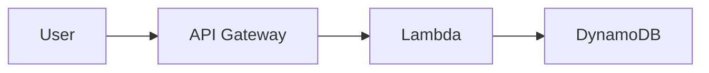

# Diagra — Mermaid, but beautiful.

Diagra is an open-source diagram renderer for Mermaid-compatible flowcharts with icon, theme, animation, and export directives.

## Install

```bash
pnpm install
pnpm build
pnpm exec diagra render examples/aws-serverless.diagra
```

## Quick Start



## Features

- Mermaid-compatible flowchart syntax
- AWS, GCP, Azure, and generic icon class support
- Light, dark, neutral, and brand themes
- Animated data-flow SVG output
- Export to SVG, PNG, HTML, Draw.io, and Mermaid
- CLI plus TypeScript library API

## CLI

```bash
diagra render diagram.diagra
diagra render diagram.diagra --format all
diagra watch diagram.diagra
diagra init --template aws-serverless
diagra icons list --pack aws
diagra validate diagram.diagra
```

## Library

```ts
import { Diagra } from "@diagra/core";

const diagra = new Diagra();
const result = await diagra.render(source, { theme: "dark", animate: "flow" });
console.log(result.svg);
```

See `docs/` and `examples/` for syntax and templates.
