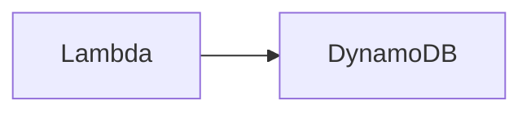

# Diagra Syntax

Diagra files are Mermaid flowcharts with optional top-of-file directives.

```mermaid
%%diagra:theme dark
%%diagra:icons aws
%%diagra:animate flow
%%diagra:font Inter
%%diagra:accent #FF6B35

flowchart LR
  A[Lambda]:::aws-lambda --> B[DynamoDB]:::aws-dynamodb
```

Supported MVP directives are `theme`, `icons`, `animate`, `font`, and `accent`.
