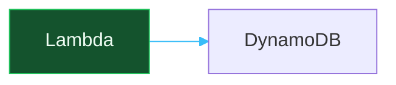

# Diagra Syntax

Diagra files are Mermaid flowcharts with optional top-of-file directives.



Supported MVP directives are `theme`, `icons`, `animate`, `font`, and `accent`.

Use Mermaid `style` to customize node boxes and labels:

```mermaid
style Build fill:#4338CA,stroke:#818CF8,color:#EEF2FF
```

Use Mermaid `linkStyle` to customize edge lines and edge labels. Link indexes are zero-based, matching Mermaid:

```mermaid
linkStyle 0 stroke:#38BDF8,color:#E0F2FE
```

Use Mermaid `subgraph` blocks to draw containers around related nodes. Nested subgraphs are supported:

```mermaid
subgraph platform[Production Platform]
  subgraph app[Application Services]
    Gateway[API Gateway] --> Web[Web Service]
  end
end

style platform fill:#0F172A,stroke:#64748B,color:#CBD5E1
style app fill:#1D4ED8,stroke:#60A5FA,color:#DBEAFE
```
